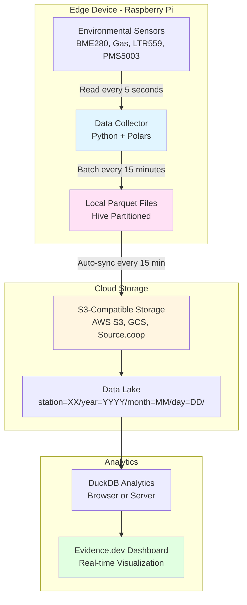
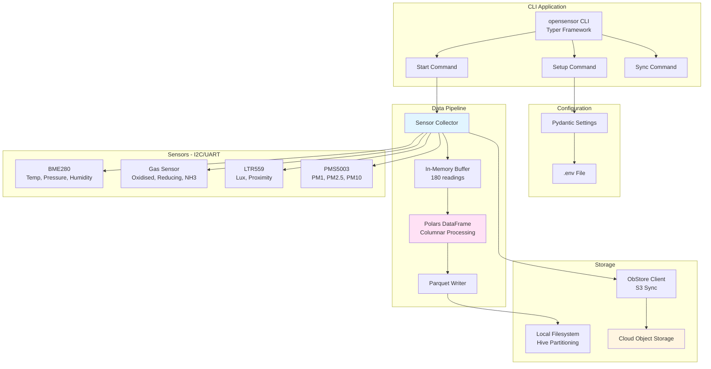
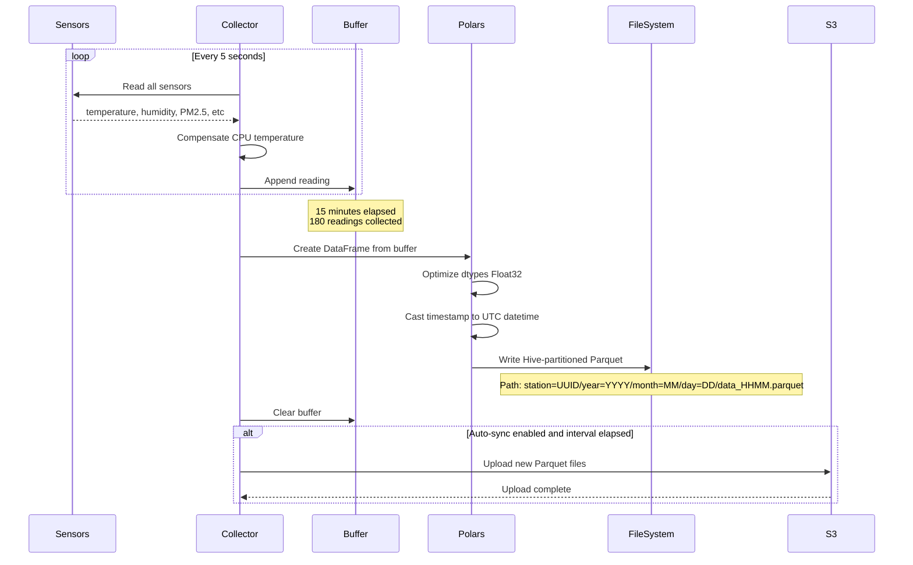
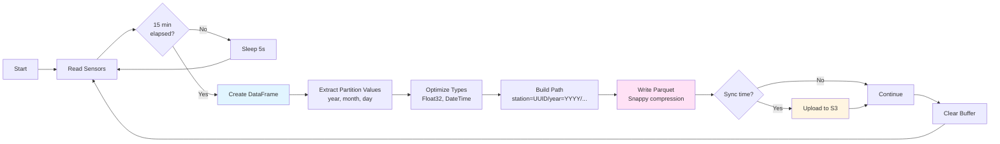
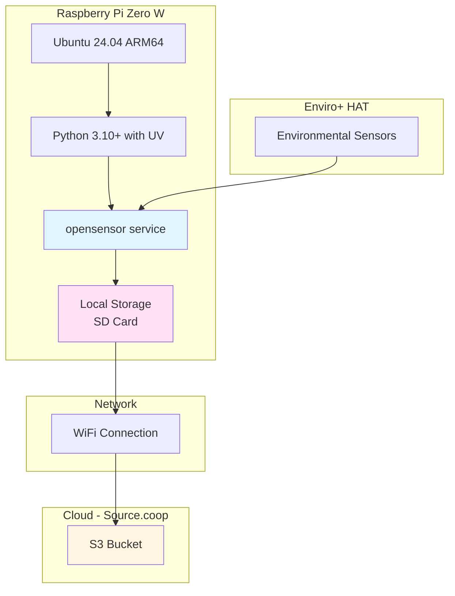
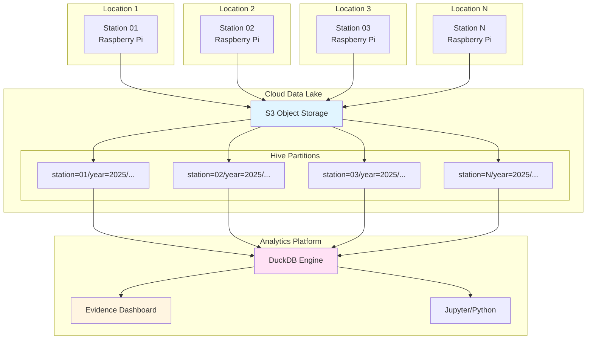
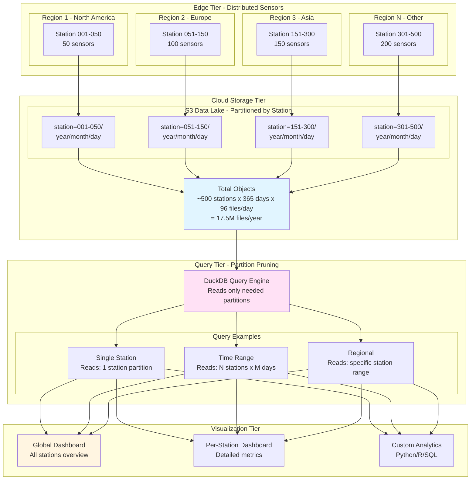

# OpenSensor-Enviroplus Architecture

> Cloud-native environmental sensor data collection for Raspberry Pi Enviro+

## Overview

OpenSensor-Enviroplus enables edge devices to collect, process, and sync environmental sensor data directly to cloud object storage without intermediate databases or message brokers.

**Key Principles:**
- **Edge-First**: Process locally, sync when connected
- **Open Standards**: Parquet, S3, Hive partitioning
- **Simplicity**: Just files, no infrastructure
- **Scalability**: From 1 to 1000+ sensors

---

## System Architecture

### High-Level Overview



**Data Flow:**
1. **Collect**: Read sensors every 5 seconds
2. **Batch**: Accumulate 180 readings (15 minutes)
3. **Write**: Save as Hive-partitioned Parquet
4. **Sync**: Upload to S3 automatically
5. **Analyze**: Query with DuckDB from anywhere

---

## Component Architecture



**Components:**
- **CLI**: User interface (setup, start, sync, status)
- **Collector**: Reads sensors, manages batches
- **Polars**: Fast columnar data processing
- **ObStore**: Efficient S3 sync (Rust-based)
- **Hive Partitioning**: Time-based organization

---

## Data Flow

### Sensor to Cloud Pipeline



**Timing:**
- **Read Interval**: 5 seconds
- **Batch Duration**: 900 seconds (15 minutes)
- **Batch Size**: ~180 readings
- **Sync Interval**: 15 minutes (configurable)

### Batch Processing Flow



---

## Deployment Architecture

### Single Station



**Hardware Requirements:**
- Raspberry Pi Zero W or better
- Enviro+ HAT with sensors
- 16GB+ SD card
- WiFi connectivity

### Multi-Station Network



**Network Characteristics:**
- Fully decentralized edge processing
- No central hub or coordinator needed
- Each station operates independently
- Offline-first with automatic sync
- Scales to 1000+ stations

---

## Scalability: Hundreds of Sensors

### Global Sensor Network Architecture



### Scalability Metrics

**Storage Scaling** (per sensor, per year):
- **Readings**: 5-second interval = 6.3M readings/year
- **Batch Files**: 15-minute batches = ~35,000 files/year
- **File Size**: ~10-50KB per file (Snappy compressed)
- **Annual Storage**: ~350MB - 1.75GB per sensor per year
- **500 sensors**: ~175GB - 875GB per year

**Query Performance** (DuckDB):
- **Single Station Query**: Scans only 1 station partition (~1GB/year)
- **Time Range Query**: Partition pruning by year/month/day
- **Multi-Station Aggregate**: Parallel scan across partitions
- **Typical Query Time**: 100ms - 5s (depending on scope)

**Network Efficiency**:
- **Upload per Sensor**: ~2-10MB/hour (15-min sync)
- **500 Sensors**: ~1-5GB/hour total network traffic
- **Offline Resilience**: Each sensor buffers locally, syncs when online
- **Bandwidth**: Works on standard WiFi/4G connections

**Cost Scaling** (estimated, Source.coop provides free storage):
- **S3 Storage**: $0.023/GB/month standard tier
- **500 sensors x 1GB/year**: ~$11/month after first year
- **Data Transfer**: $0.09/GB (out to internet)
- **No compute costs**: Edge processing, browser analytics

**Operational Benefits**:
- ✅ **No Servers**: Fully serverless architecture
- ✅ **No Databases**: Direct file-based queries
- ✅ **No Message Queues**: Async file sync
- ✅ **Automatic Scaling**: Object storage handles millions of files
- ✅ **Geographic Distribution**: Sensors anywhere with internet
- ✅ **Offline Operation**: Continue collecting during outages

---

## Storage Structure

### Hive Partitioning Layout

```
output/
└── station=bd58fce2-5e40-4b07-b9f9-73d4f3139054/
    └── year=2025/
        └── month=11/
            └── day=24/
                ├── data_0900.parquet (15-min batch ending 09:00)
                ├── data_0915.parquet (15-min batch ending 09:15)
                ├── data_0930.parquet (15-min batch ending 09:30)
                └── data_0945.parquet (15-min batch ending 09:45)
```

**Partition Columns** (automatically extracted by DuckDB):
- `station`: UUID of the sensor station
- `year`: YYYY
- `month`: MM (zero-padded)
- `day`: DD (zero-padded)

**File Naming**:
- Format: `data_{HHMM}.parquet`
- `{HHMM}`: Batch end time in 24-hour format
- Example: `data_0915.parquet` = batch ending at 09:15 UTC

### Querying with DuckDB

**Basic Query** (Browser or CLI):
```sql
-- Read all data with automatic partition extraction
SELECT * FROM read_parquet('output/**/*.parquet', hive_partitioning=true);

-- Query specific time range (partition pruning)
SELECT
    timestamp,
    temperature,
    humidity,
    pm2_5
FROM read_parquet('output/**/*.parquet', hive_partitioning=true)
WHERE year = 2025
  AND month = 11
  AND day = 24
  AND station = 'bd58fce2-5e40-4b07-b9f9-73d4f3139054';

-- Aggregate across all stations
SELECT
    station,
    DATE_TRUNC('hour', timestamp) as hour,
    AVG(temperature) as avg_temp,
    AVG(humidity) as avg_humidity,
    AVG(pm2_5) as avg_pm25
FROM read_parquet('s3://bucket/**/*.parquet', hive_partitioning=true)
WHERE year = 2025 AND month = 11
GROUP BY station, hour
ORDER BY hour;
```

---

## Key Design Decisions

### Why Parquet + Hive Partitioning?

| Feature | Benefit |
|---------|---------|
| **Columnar Format** | 10-100x faster analytics queries |
| **Compression** | 3-10x smaller than CSV (Snappy) |
| **Type Safety** | Schema enforcement, no parsing errors |
| **Partition Pruning** | Query only relevant files (year/month/day) |
| **Universal Support** | DuckDB, Polars, Spark, Pandas all work |
| **Browser Compatible** | DuckDB-wasm can query directly |

### Why Not Delta Lake / Iceberg?

**For append-only time-series data:**
- ❌ Delta Lake adds complexity (_delta_log transaction logs)
- ❌ Limited browser support (DuckDB-wasm)
- ❌ Overhead for ACID features we don't need
- ✅ Simple Parquet is perfect for append-only sensors
- ✅ Hive partitioning provides all needed organization

### Why ObStore over boto3?

| ObStore | boto3 |
|---------|-------|
| **Rust-based** | Python-based |
| **50% faster** | Baseline |
| **Lower memory** | Higher memory |
| **Unified API** | S3-specific |
| **S3/GCS/Azure** | Separate clients |

### Why Edge Processing?

**Benefits:**
- **Resilience**: Works offline, syncs when online
- **Bandwidth**: 60-90% reduction (batch vs stream)
- **Carbon**: Lower energy than continuous cloud streaming
- **Cost**: No always-on servers

**Tradeoffs:**
- Need SD card storage (~1-2GB/year)
- 15-minute delay vs real-time
- Requires WiFi for cloud sync

---

## Performance Characteristics

| Metric | Value |
|--------|-------|
| **Read Interval** | 5 seconds |
| **Batch Duration** | 900 seconds (15 minutes) |
| **Readings per Batch** | ~180 readings |
| **Memory per Batch** | ~50-100MB |
| **File Size** | ~10-50KB (Snappy compressed) |
| **Sync Interval** | 15 minutes (configurable) |
| **Network Usage** | ~2-10MB/hour |
| **CPU Usage** | <5% (Raspberry Pi Zero W) |
| **Startup Time** | <2 seconds |
| **Annual Storage** | ~350MB - 1.75GB per sensor |

---

## Configuration

**Environment Variables** (`.env` file):

```bash
# Station Identification
OPENSENSOR_STATION_ID=bd58fce2-5e40-4b07-b9f9-73d4f3139054

# Collection Settings
OPENSENSOR_READ_INTERVAL=5        # Seconds between sensor reads
OPENSENSOR_BATCH_DURATION=900     # Seconds per batch (15 minutes)

# Output Settings
OPENSENSOR_OUTPUT_DIR=output
OPENSENSOR_COMPRESSION=snappy     # or zstd, gzip

# Cloud Sync
OPENSENSOR_SYNC_ENABLED=true
OPENSENSOR_SYNC_INTERVAL_MINUTES=15
OPENSENSOR_STORAGE_BUCKET=my-bucket
OPENSENSOR_STORAGE_PREFIX=sensor-data
OPENSENSOR_STORAGE_REGION=us-west-2
OPENSENSOR_AWS_ACCESS_KEY_ID=AKIA...
OPENSENSOR_AWS_SECRET_ACCESS_KEY=secret...

# Logging
OPENSENSOR_LOG_LEVEL=INFO
```

---

## References

- **OpenSensor.Space**: https://opensensor.space
- **Polars Documentation**: https://docs.pola.rs
- **DuckDB**: https://duckdb.org
- **ObStore**: https://developmentseed.org/obstore
- **Evidence.dev**: https://evidence.dev
- **Source Cooperative**: https://source.coop

---

**Last Updated**: 2025-11-24
**Version**: 1.1
