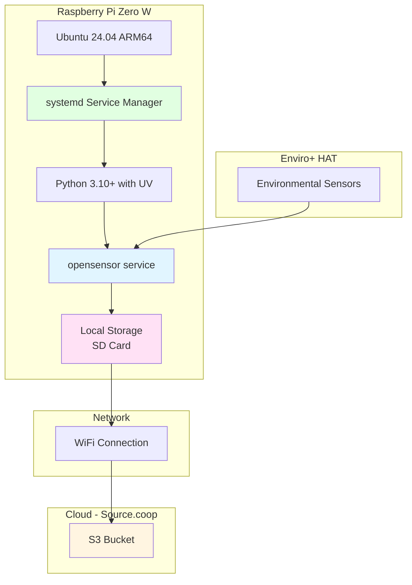
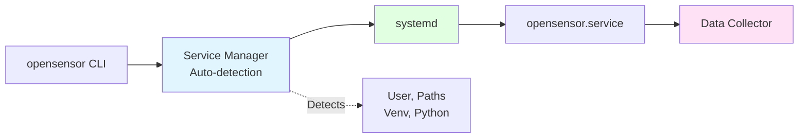

# OpenSensor-Enviroplus Architecture

> Cloud-native environmental sensor data collection for Raspberry Pi Enviro+

## Overview

OpenSensor-Enviroplus enables edge devices to collect, process, and sync environmental sensor data directly to cloud object storage without intermediate databases or message brokers.

**Key Principles:**
- **Edge-First**: Process locally, sync when connected
- **Open Standards**: Parquet, S3, Hive partitioning
- **Simplicity**: Just files, no infrastructure
- **Scalability**: From 1 to 1000+ sensors
- **Observability**: Optional system health monitoring for remote debugging

---

## System Architecture

### High-Level Overview


**Data Flow:**
1. **Collect**: Read sensors every 5 seconds
2. **Batch**: Accumulate 180 readings (15 minutes)
3. **Write**: Save as Hive-partitioned Parquet
4. **Sync**: Upload to S3 automatically
5. **Analyze**: Query with DuckDB from anywhere

---

## Component Architecture


**Components:**
- **CLI**: User interface (setup, start, sync, status)
- **Collector**: Reads sensors, manages batches
- **Polars**: Fast columnar data processing
- **ObStore**: Efficient S3 sync (Rust-based)
- **Hive Partitioning**: Time-based organization

---

## Data Flow

### Sensor to Cloud Pipeline


**Timing:**
- **Read Interval**: 5 seconds
- **Batch Duration**: 900 seconds (15 minutes)
- **Batch Size**: ~180 readings
- **Sync Interval**: 15 minutes (configurable)

### Batch Processing Flow


---

## Deployment Architecture

### Single Station



**Hardware Requirements:**
- Raspberry Pi Zero W or better
- Enviro+ HAT with sensors
- 16GB+ SD card
- WiFi connectivity

**Software Deployment:**
- Runs as systemd service (auto-start on boot)
- Automatic restarts on failure
- Managed via CLI commands
- Logs via journalctl

### Multi-Station Network


**Network Characteristics:**
- Fully decentralized edge processing
- No central hub or coordinator needed
- Each station operates independently
- Offline-first with automatic sync
- Scales to 1000+ stations

---

## Scalability: Hundreds of Sensors

### Global Sensor Network Architecture


### Scalability Metrics

**Storage Scaling** (per sensor, per year):
- **Readings**: 5-second interval = 6.3M readings/year
- **Batch Files**: 15-minute batches = ~35,000 files/year
- **File Size**: ~10-50KB per file (Snappy compressed)
- **Annual Storage**: ~350MB - 1.75GB per sensor per year
- **500 sensors**: ~175GB - 875GB per year

**Query Performance** (DuckDB):
- **Single Station Query**: Scans only 1 station partition (~1GB/year)
- **Time Range Query**: Partition pruning by year/month/day
- **Multi-Station Aggregate**: Parallel scan across partitions
- **Typical Query Time**: 100ms - 5s (depending on scope)

**Network Efficiency**:
- **Upload per Sensor**: ~2-10MB/hour (15-min sync)
- **500 Sensors**: ~1-5GB/hour total network traffic
- **Offline Resilience**: Each sensor buffers locally, syncs when online
- **Bandwidth**: Works on standard WiFi/4G connections

**Cost Scaling** (estimated, Source.coop provides free storage):
- **S3 Storage**: $0.023/GB/month standard tier
- **500 sensors x 1GB/year**: ~$11/month after first year
- **Data Transfer**: $0.09/GB (out to internet)
- **No compute costs**: Edge processing, browser analytics

**Operational Benefits**:
- ✅ **No Servers**: Fully serverless architecture
- ✅ **No Databases**: Direct file-based queries
- ✅ **No Message Queues**: Async file sync
- ✅ **Automatic Scaling**: Object storage handles millions of files
- ✅ **Geographic Distribution**: Sensors anywhere with internet
- ✅ **Offline Operation**: Continue collecting during outages

---

## Storage Structure

### Hive Partitioning Layout

```
output/
└── station=bd58fce2-5e40-4b07-b9f9-73d4f3139054/
    └── year=2025/
        └── month=11/
            └── day=24/
                ├── data_0900.parquet (15-min batch ending 09:00)
                ├── data_0915.parquet (15-min batch ending 09:15)
                ├── data_0930.parquet (15-min batch ending 09:30)
                └── data_0945.parquet (15-min batch ending 09:45)
```

**Partition Columns** (automatically extracted by DuckDB):
- `station`: UUID of the sensor station
- `year`: YYYY
- `month`: MM (zero-padded)
- `day`: DD (zero-padded)

**File Naming**:
- Format: `data_{HHMM}.parquet`
- `{HHMM}`: Batch end time in 24-hour format
- Example: `data_0915.parquet` = batch ending at 09:15 UTC

### Querying with DuckDB

**Basic Query** (Browser or CLI):
```sql
-- Read all data with automatic partition extraction
SELECT * FROM read_parquet('output/**/*.parquet', hive_partitioning=true);

-- Query specific time range (partition pruning)
SELECT
    timestamp,
    temperature,
    humidity,
    pm2_5
FROM read_parquet('output/**/*.parquet', hive_partitioning=true)
WHERE year = 2025
  AND month = 11
  AND day = 24
  AND station = 'bd58fce2-5e40-4b07-b9f9-73d4f3139054';

-- Aggregate across all stations
SELECT
    station,
    DATE_TRUNC('hour', timestamp) as hour,
    AVG(temperature) as avg_temp,
    AVG(humidity) as avg_humidity,
    AVG(pm2_5) as avg_pm25
FROM read_parquet('s3://bucket/**/*.parquet', hive_partitioning=true)
WHERE year = 2025 AND month = 11
GROUP BY station, hour
ORDER BY hour;
```

---

## Key Design Decisions

### Why Parquet + Hive Partitioning?

| Feature | Benefit |
|---------|---------|
| **Columnar Format** | 10-100x faster analytics queries |
| **Compression** | 3-10x smaller than CSV (Snappy) |
| **Type Safety** | Schema enforcement, no parsing errors |
| **Partition Pruning** | Query only relevant files (year/month/day) |
| **Universal Support** | DuckDB, Polars, Spark, Pandas all work |
| **Browser Compatible** | DuckDB-wasm can query directly |

### Why Not Delta Lake / Iceberg?

**For append-only time-series data:**
- ❌ Delta Lake adds complexity (_delta_log transaction logs)
- ❌ Limited browser support (DuckDB-wasm)
- ❌ Overhead for ACID features we don't need
- ✅ Simple Parquet is perfect for append-only sensors
- ✅ Hive partitioning provides all needed organization

### Why ObStore over boto3?

| ObStore | boto3 |
|---------|-------|
| **Rust-based** | Python-based |
| **50% faster** | Baseline |
| **Lower memory** | Higher memory |
| **Unified API** | S3-specific |
| **S3/GCS/Azure** | Separate clients |

### Why Edge Processing?

**Benefits:**
- **Resilience**: Works offline, syncs when online
- **Bandwidth**: 60-90% reduction (batch vs stream)
- **Carbon**: Lower energy than continuous cloud streaming
- **Cost**: No always-on servers

**Tradeoffs:**
- Need SD card storage (~1-2GB/year)
- 15-minute delay vs real-time
- Requires WiFi for cloud sync

---

## Performance Characteristics

| Metric | Value |
|--------|-------|
| **Read Interval** | 5 seconds |
| **Batch Duration** | 900 seconds (15 minutes) |
| **Readings per Batch** | ~180 readings |
| **Memory per Batch** | ~50-100MB |
| **File Size** | ~10-50KB (Snappy compressed) |
| **Sync Interval** | 15 minutes (configurable) |
| **Network Usage** | ~2-10MB/hour |
| **CPU Usage** | <5% (Raspberry Pi Zero W) |
| **Startup Time** | <2 seconds |
| **Annual Storage** | ~350MB - 1.75GB per sensor |

---

## Service Deployment

### Systemd Service Management

The application runs as a systemd service for production deployment:

**Service Features:**
- **Auto-start**: Starts on boot automatically
- **Auto-restart**: Restarts on failure (10s delay)
- **Security**: Sandboxed with systemd security features
- **Logging**: Integrated with journald
- **Management**: Simple CLI commands

**Quick Setup:**
```bash
# One-command setup (install + enable + start)
sudo opensensor service setup

# View status
sudo opensensor service status

# View logs
sudo opensensor service logs --follow
```

**Service Architecture:**


**Service Commands:**
- `install` - Create systemd service
- `enable` - Enable on boot
- `start` - Start service
- `stop` - Stop service
- `restart` - Restart service
- `status` - View status
- `logs` - View logs
- `setup` - Quick install+enable+start
- `remove` - Complete removal

**Auto-Detection:**
The service manager automatically detects:
- Current user (works with any username)
- Project root directory
- Virtual environment path
- Python executable path
- All required configuration

---

## Edge Cases & Error Handling

The system handles numerous edge cases for robust production operation:

### **Data Collection Edge Cases**

**1. Sensor Warm-up Period**
- **Issue**: Sensors give inaccurate readings when first powered on
- **Solution**: Skip first 10 readings (~50 seconds)
- **Details**:
  - BME280: Self-heating causes 1-2°C temperature error
  - PMS5003: Fan needs 30s to stabilize
  - Gas sensors: Need time to reach operating temperature (150°C+)
- **Code**: `readings_count <= warmup_readings` check in `collect_reading()`

**2. Clock-Aligned Batch Boundaries**
- **Issue**: Starting at arbitrary times creates inconsistent batch times
- **Solution**: Align to clock boundaries (00, 15, 30, 45 minutes)
- **Edge Case**: Hour rollover (e.g., 10:45 → 11:00)
- **Handling**: `timedelta(hours=1)` when `next_boundary_minute >= 60`
- **Benefit**: Consistent file timestamps across all sensors

**3. Variable First Batch Size**
- **Issue**: First batch depends on when script started
- **Example**: Start at 10:37, first batch at 10:45 = ~8 min (~96 readings)
- **Handling**: Subsequent batches are full 15 min (~180 readings)
- **No Problem**: Data is timestamped, variable size is expected

**4. Empty Batches**
- **Issue**: No data collected (all sensors failed)
- **Handling**: Log warning, skip write, continue collecting
- **Code**: `if not self.buffer: logger.warning()` in `flush_batch()`

### **Sensor Hardware Edge Cases**

**5. Temperature Compensation**
- **Issue**: Raspberry Pi CPU heat affects BME280 readings
- **Solution**: CPU temperature compensation with configurable factor (applied in both collector and `opensensor test`)
- **Formula**: `temp - ((avg_cpu_temp - temp) / compensation_factor)`
- **Default Factor**: 2.25 (Pimoroni's official factor)
- **Tracking**: Rolling average of last 5 CPU temp readings

**5b. Humidity Compensation**
- **Issue**: BME280's humidity reading is affected by temperature errors
- **Solution**: Dewpoint-based compensation from Pimoroni's official examples
- **Formula**:
  1. Calculate dewpoint: `dewpoint = raw_temp - ((100 - raw_humidity) / 5)`
  2. Recalculate: `humidity = 100 - (5 * (compensated_temp - dewpoint))`
- **Data**: Both `humidity` (compensated) and `raw_humidity` stored in Parquet
- **Reference**: https://github.com/pimoroni/enviroplus-python/blob/main/examples/weather-and-light.py

**6. PMS5003 Read Timeouts**
- **Issue**: Particulate sensor occasionally times out
- **Handling**: Catch `ReadTimeoutError`, set PM values to `None`, continue
- **Code**: Specific exception handling in `read_sensors()`
- **Benefit**: One sensor failure doesn't stop entire collection

**7. Sensor Initialization Failures**
- **Issue**: Sensor hardware not available or I2C failures
- **Handling**: Set sensor to `None`, continue with available sensors
- **Mock Mode**: If no sensors available, logs warning and continues
- **Code**: Try/except blocks in `_init_sensors()`

**8. Gas Sensor Null Values**
- **Issue**: Gas readings occasionally return `None`
- **Handling**: Fields default to `None` if sensor read fails
- **Benefit**: Partial data better than no data

### **Data Storage Edge Cases**

**9. Hive Partition Column Redundancy**
- **Issue**: `station_id` stored in both directory and parquet file
- **Solution**: Remove from parquet, keep only in directory structure
- **Benefit**: Saves ~6KB per file (180 rows × UUID)
- **Query**: DuckDB auto-extracts with `hive_partitioning=true`
- **Standard**: Follows Hive/Delta Lake/Iceberg best practices

**10. Directory Creation Race Conditions**
- **Issue**: Multiple processes creating same directory
- **Handling**: `mkdir(parents=True, exist_ok=True)`
- **Benefit**: No crashes if directory exists

**11. Partition Path Validation**
- **Issue**: Invalid characters in station_id or dates
- **Solution**: UUID validation in config, datetime validation
- **Format**: `station={uuid}/year={yyyy}/month={mm}/day={dd}/`

**12. Type Optimization for Memory**
- **Issue**: Float64 uses 2x memory of Float32
- **Solution**: Cast all sensor values to Float32
- **Benefit**: 50% memory reduction for sensor data
- **Acceptable**: Sensor precision doesn't require Float64

### **Cloud Sync Edge Cases**

**13. Network Failures During Sync**
- **Issue**: WiFi drops during upload
- **Handling**: Log error, continue collecting, retry next interval
- **Code**: Try/except in `sync_data()`, doesn't stop collection
- **Benefit**: Offline-first architecture

**14. S3 Credential Errors**
- **Issue**: Invalid AWS credentials or permissions
- **Handling**: Sync fails, logs error, collection continues
- **Warning**: Logs accumulate locally until credentials fixed

**15. Sync Interval vs Batch Interval**
- **Issue**: What if sync_interval < batch_duration?
- **Handling**: Works fine, syncs whatever files exist
- **Typical**: Both at 15 minutes for consistency

### **Service Management Edge Cases**

**16. User Detection Under Sudo**
- **Issue**: `os.environ.get('USER')` returns 'root' when using sudo
- **Solution**: Check `SUDO_USER` first, fallback to `USER`
- **Code**: `sudo_user = os.environ.get('SUDO_USER')`
- **Benefit**: Service runs as actual user, not root

**17. Project Root Detection**
- **Issue**: Script could be run from anywhere
- **Solution**: Walk up directory tree looking for `pyproject.toml`
- **Fallback**: Try current working directory
- **Code**: `for parent in [current] + list(current.parents)`

**18. Virtual Environment Detection**
- **Issue**: `.venv` or `venv` or custom name?
- **Solution**: Check `VIRTUAL_ENV` env var, then `.venv`, then `venv`
- **Benefit**: Works with UV, virtualenv, venv

**19. Service File Overwrites**
- **Issue**: Running install twice
- **Handling**: Overwrites existing file, systemd daemon-reload
- **Benefit**: Easy updates to service configuration

**20. Service Stop During Batch Write**
- **Issue**: SIGTERM during parquet write could corrupt file
- **Handling**: Graceful shutdown, flush current batch on KeyboardInterrupt
- **Code**: Try/except KeyboardInterrupt in `run()`

### **System Health Monitoring**

**29. Health Metrics Collection**
- **Purpose**: Remote monitoring and debugging of field deployments
- **Metrics collected** (~1 minute interval):
  - CPU temperature and load (1, 5, 15 min averages)
  - Memory total, available, percent used
  - Disk total, free, percent used
  - WiFi SSID, signal strength (dBm), quality percent
  - NTP clock sync status and offset (critical for time-series integrity)
  - Power source (mains/battery) and battery percent
  - System uptime
- **Storage**: Separate `output-health/` directory with identical partition structure
- **Configuration**: `OPENSENSOR_HEALTH_ENABLED=true|false` (default: true)
- **Rationale**: Based on IIoT field experience - helps diagnose issues like:
  - WiFi signal degradation
  - Clock drift affecting data quality
  - Power failures
  - Disk space exhaustion

**30. Health Data Separation**
- **Issue**: Health data has different schema than sensor data
- **Solution**: Sibling directory (`output-health/`) instead of subdirectory
- **Benefit**: DuckDB queries on `output/**/*.parquet` work unchanged
- **Structure**:
  ```
  output/           # Sensor data
  output-health/    # Health metrics (same partition structure)
  ```

### **Development Edge Cases**

**21. Pre-commit Hook Bypass**
- **Issue**: Emergency commit needed, hooks failing
- **Solution**: `git commit --no-verify`
- **Documentation**: Mentioned in CONTRIBUTING.md

**22. Python Version Compatibility**
- **Issue**: Different Python versions (3.10-3.13)
- **Testing**: GitHub Actions CI tests on all versions
- **Type Hints**: Use Python 3.10+ style (`tuple` not `Tuple`)

**23. Ruff Version Mismatches**
- **Issue**: Local ruff different from pre-commit
- **Solution**: Pin version in both `pyproject.toml` and `.pre-commit-config.yaml`
- **Current**: v0.14.6 in both places

**24. Missing .env File**
- **Issue**: Running without configuration
- **Handling**: Pydantic raises clear error, tells user to run `opensensor setup`
- **Code**: FileNotFoundError catch in CLI commands

**25. Log File Growth**
- **Issue**: Logs accumulate indefinitely
- **Current**: No rotation implemented (future enhancement)
- **Workaround**: Monitor with `opensensor status`, manual cleanup if needed

### **Performance Edge Cases**

**26. Large Batch Memory Usage**
- **Issue**: 15-min batch = ~180 readings × 19 columns
- **Optimization**: Use Float32, in-memory buffer only
- **Typical**: ~50-100MB per batch
- **Safe**: Even on Raspberry Pi Zero W (512MB RAM)

**27. Slow SD Card Writes**
- **Issue**: SD card performance varies
- **Mitigation**: Snappy compression (fast), async writes possible
- **Monitoring**: Log write duration for each batch

**28. I2C Bus Contention**
- **Issue**: Multiple sensors on same I2C bus
- **Handling**: Sequential reads, not parallel
- **Timing**: 5-second interval leaves plenty of time

---

## Configuration

**Environment Variables** (`.env` file):

```bash
# Station Identification
OPENSENSOR_STATION_ID=bd58fce2-5e40-4b07-b9f9-73d4f3139054

# Collection Settings
OPENSENSOR_READ_INTERVAL=5        # Seconds between sensor reads
OPENSENSOR_BATCH_DURATION=900     # Seconds per batch (15 minutes)

# Output Settings
OPENSENSOR_OUTPUT_DIR=output
OPENSENSOR_COMPRESSION=snappy     # or zstd, gzip

# Cloud Sync
OPENSENSOR_SYNC_ENABLED=true
OPENSENSOR_SYNC_INTERVAL_MINUTES=15
OPENSENSOR_STORAGE_BUCKET=my-bucket
OPENSENSOR_STORAGE_PREFIX=sensor-data
OPENSENSOR_STORAGE_REGION=us-west-2
OPENSENSOR_AWS_ACCESS_KEY_ID=AKIA...
OPENSENSOR_AWS_SECRET_ACCESS_KEY=secret...

# Health Monitoring
OPENSENSOR_HEALTH_ENABLED=true    # Enable/disable health collection

# Logging
OPENSENSOR_LOG_LEVEL=INFO
```

---

## Health Monitoring

System health monitoring provides visibility into edge device status for remote debugging:

### Health Metrics Schema

| Field | Type | Description |
|-------|------|-------------|
| `timestamp` | datetime | Collection time (UTC) |
| `cpu_temp_c` | float | CPU temperature in Celsius |
| `cpu_load_1min` | float | 1-minute load average |
| `cpu_load_5min` | float | 5-minute load average |
| `cpu_load_15min` | float | 15-minute load average |
| `memory_total_mb` | float | Total RAM in MB |
| `memory_available_mb` | float | Available RAM in MB |
| `memory_percent_used` | float | Memory usage percentage |
| `disk_total_gb` | float | Total disk in GB |
| `disk_free_gb` | float | Free disk in GB |
| `disk_percent_used` | float | Disk usage percentage |
| `wifi_ssid` | string | Connected WiFi network |
| `wifi_signal_dbm` | int | Signal strength in dBm |
| `wifi_quality_percent` | float | Signal quality (0-100%) |
| `ip_address` | string | Primary IP address |
| `clock_synced` | bool | NTP sync status |
| `ntp_offset_ms` | float | Clock offset from NTP |
| `uptime_seconds` | float | System uptime |
| `power_source` | string | "mains", "battery", or null |
| `battery_percent` | float | Battery level if on UPS |

### Querying Health Data

```sql
-- Check NTP sync status across all stations
SELECT
    station,
    timestamp,
    clock_synced,
    ntp_offset_ms,
    wifi_signal_dbm
FROM read_parquet('output-health/**/*.parquet', hive_partitioning=true)
WHERE NOT clock_synced OR ntp_offset_ms > 100
ORDER BY timestamp DESC;

-- Monitor memory pressure
SELECT
    station,
    DATE_TRUNC('hour', timestamp) as hour,
    AVG(memory_percent_used) as avg_mem,
    MAX(memory_percent_used) as max_mem
FROM read_parquet('output-health/**/*.parquet', hive_partitioning=true)
GROUP BY station, hour
HAVING AVG(memory_percent_used) > 80;
```

---

## References

- **OpenSensor.Space**: https://opensensor.space
- **Polars Documentation**: https://docs.pola.rs
- **DuckDB**: https://duckdb.org
- **ObStore**: https://developmentseed.org/obstore
- **Evidence.dev**: https://evidence.dev
- **Source Cooperative**: https://source.coop

---

**Last Updated**: 2025-11-28
**Version**: 1.4

## Recent Updates (v1.4)

**System Health Monitoring** (2025-11-28):
- Added comprehensive health metrics collection (CPU, memory, disk, WiFi, NTP)
- Separate `output-health/` directory for health data
- Optional via `OPENSENSOR_HEALTH_ENABLED` configuration
- Critical for remote debugging of field deployments

**Humidity Compensation** (2025-11-28):
- Implemented dewpoint-based humidity correction from Pimoroni's official examples
- Both raw and compensated humidity values stored
- More accurate readings when temperature compensation is enabled

**Shared Utilities Refactoring** (2025-11-28):
- New `utils/env.py` module for shared environment detection
- Improved .env file discovery across different installation types
- Better handling of uvx, uv tool, and venv installations
- Reduced code duplication between CLI and service manager

## Previous Updates (v1.3)

**Edge Case Documentation** (2025-11-25):
- Comprehensive edge case handling documentation
- 28 documented edge cases across all system components
- Sensor warm-up, clock alignment, error handling details

**Data Optimizations** (2025-11-25):
- Clock-aligned batch boundaries (00, 15, 30, 45 minutes)
- Removed station_id from parquet files (Hive partitioning optimization)
- Sensor warm-up period (skip first 10 readings)
- Temperature compensation for CPU heat

**Service Management** (2025-11-25):
- Added systemd service integration
- Smart auto-detection of user, paths, and environment
- 12 CLI service commands for complete lifecycle management
- Security hardening with systemd features
- Automatic restart on failure

**CI/CD Pipeline** (2025-11-25):
- GitHub Actions workflows (CI, Lint, Release)
- Multi-Python testing (3.10, 3.11, 3.12, 3.13)
- Automated PyPI publishing with trusted publishing
- Pre-commit hooks with Ruff v0.14.6
